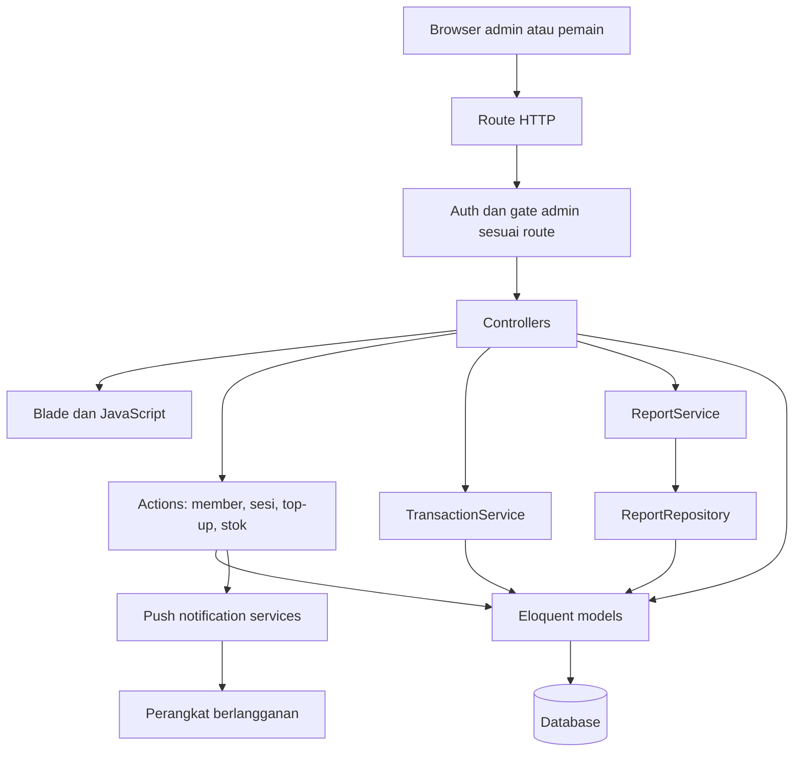

# Status proyek: rujukan dan arsip

**Acuan aktif:** [konteks final proyek](11-final-context.md) dan [matriks fitur](10-current-features.md), diperbarui setelah integrasi kas–kuota pada 7 September 2026.

Dokumen ini dipertahankan agar tautan dan catatan pemeriksaan 6 September tidak hilang. Seluruh bagian setelah batas arsip di bawah adalah snapshot historis. Pernyataan dependency belum tersedia, backend belum diuji, top-up belum mencatat income, charged_absent memotong kuota, dan Graphify belum diperbarui **tidak berlaku sebagai status terbaru**.

Perubahan berikutnya dicatat pada konteks final dan matriks fitur, bukan pada snapshot arsip ini.

## Arsip pemeriksaan 6 September 2026

---

# Status dan konteks proyek NgeBadmintonYuk — arsip

Tanggal pemeriksaan: **6 September 2026**.

Dokumen ini adalah titik masuk untuk memahami implementasi saat ini. Dasarnya adalah kode, route, migration, test, dan aturan proyek di workspace; bukan pemeriksaan database produksi atau bukti seluruh fitur sudah berjalan. Spesifikasi awal pada dokumen 01–09 tetap disimpan sebagai referensi desain, tetapi tidak seluruhnya mencerminkan scope dan arsitektur sekarang.

## Posisi proyek

Proyek bermula sebagai **NgeKas**, aplikasi kas satu admin. Implementasi sekarang sudah melampaui MVP keuangan menjadi aplikasi operasional komunitas: akun pemain, membership, kuota main, sesi dan waiting list, pembayaran, inventaris, notifikasi, serta papan skor.

Status yang dapat dipastikan: fitur inti sudah memiliki implementasi. Kesiapan produksi belum dapat disimpulkan karena backend belum berhasil diuji pada workspace ini dan integrasi nyata belum diperiksa. Tidak ada persentase penyelesaian karena scope terbaru belum memiliki checklist penerimaan yang disepakati.

## Peta dokumentasi

| Dokumen | Peran |
| --- | --- |
| [00-project.md](00-project.md) | Overview dan navigasi konteks terkini |
| [01-branding.md](01-branding.md) | Referensi branding awal; bukan hasil audit visual |
| [02-database.md](02-database.md) | Spesifikasi database MVP awal; migration adalah acuan skema implementasi |
| [03-authentication.md](03-authentication.md) | Spesifikasi autentikasi awal; asumsi satu admin/tanpa registrasi sudah berubah |
| [04-dashboard.md](04-dashboard.md) | Spesifikasi dashboard keuangan awal; sekarang ada dashboard member |
| [05-category.md](05-category.md), [06-income.md](06-income.md), [07-expense.md](07-expense.md) | Referensi kebutuhan keuangan awal |
| [08-report.md](08-report.md) | Referensi laporan awal; export PDF sekarang sudah diimplementasikan |
| [09-ui-guideline.md](09-ui-guideline.md) | Referensi UI awal; kesesuaian visual belum diverifikasi |
| [10-project-status.md](10-project-status.md) | Snapshot implementasi, batas verifikasi, dan pekerjaan berikutnya |
| [Index aturan proyek](../.ai/rules/index.md) | Pintu masuk aturan kerja berdasarkan area kode |

## Fitur yang sudah memiliki implementasi

“Diimplementasikan” pada tabel ini berarti jalur kode tersedia, bukan klaim telah lulus uji penerimaan.

| Modul | Implementasi yang ditemukan | Bukti utama |
| --- | --- | --- |
| Akun dan akses | Login/logout, remember me, registrasi pemain, gate admin | [Route](../routes/web.php), [AuthController](../app/Http/Controllers/AuthController.php), [RegistrationController](../app/Http/Controllers/RegistrationController.php) |
| Dashboard | Ringkasan keuangan/admin; kuota, riwayat, dan sesi yang diikuti untuk member | [DashboardController](../app/Http/Controllers/DashboardController.php) |
| Kategori | Tambah, ubah, hapus; kategori terpakai tidak boleh dihapus atau diubah tipenya | [CategoryController](../app/Http/Controllers/CategoryController.php) |
| Pemasukan/pengeluaran | CRUD, banyak detail, total dari detail, filter dan pagination | [TransactionController](../app/Http/Controllers/TransactionController.php), [TransactionService](../app/Services/TransactionService.php) |
| Laporan | Periode, total, selisih, saldo sampai tanggal akhir, ringkasan kategori, PDF | [ReportController](../app/Http/Controllers/ReportController.php), [ReportService](../app/Services/ReportService.php), [ReportRepository](../app/Repositories/ReportRepository.php) |
| Member dan membership | Pengelolaan member/paket, ledger kuota, absensi, penyesuaian kuota | [MembershipController](../app/Http/Controllers/MembershipController.php), [RecordAttendanceAction](../app/Actions/RecordAttendanceAction.php) |
| Top-up | Bukti transfer privat, harga yang diatur admin, review, kredit empat kuota | [TopUpRequestController](../app/Http/Controllers/TopUpRequestController.php), [ReviewTopUpRequestAction](../app/Actions/ReviewTopUpRequestAction.php) |
| Sesi main | Jadwal publik/admin dengan filter bulan, daftar pemain, kapasitas, waiting list, pembatalan, sanksi no-show | [RegisterForPlaySessionAction](../app/Actions/RegisterForPlaySessionAction.php), [SessionRegistrationController](../app/Http/Controllers/SessionRegistrationController.php) |
| Pembayaran sesi | Konfirmasi membuat satu pemasukan terkait; pembatalan status bayar menghapus pemasukan terkait | [RecordSessionRegistrationPaymentAction](../app/Actions/RecordSessionRegistrationPaymentAction.php) |
| Inventaris | Item shuttlecock, pergerakan stok, pencegahan stok negatif | [RecordStockMovementAction](../app/Actions/RecordStockMovementAction.php) |
| Push notification | Web Push untuk langganan baru, broadcast admin, notifikasi daftar/batal sesi, penanganan langganan FCM lama | [PushNotificationManager](../app/Services/PushNotificationManager.php), [SendSessionRegistrationNotificationAction](../app/Actions/SendSessionRegistrationNotificationAction.php) |
| Papan skor/PWA | Skor tersimpan lokal di perangkat, best of three, alur instalasi browser/iOS | [scoreboard.js](../resources/js/scoreboard.js), [pwa-install.js](../resources/js/pwa-install.js) |

## Arsitektur aktual

Implementasi halaman menggunakan **route HTTP → Controller → Blade**. Banyak proses bisnis modul tambahan ditempatkan dalam Actions dan memakai Eloquent secara langsung. Keuangan menggunakan TransactionService; laporan menggunakan ReportService dan ReportRepository.

Livewire tercantum sebagai dependency, tetapi pemeriksaan `app`, `resources`, dan `routes` tidak menemukan komponen/directive Livewire. Diagram Livewire → Service → Repository pada spesifikasi awal bukan gambaran arsitektur yang diterapkan secara menyeluruh.

Peta ini disusun dari kode secara manual; bukan hasil regenerasi Graphify. Detail route publik dan middleware tetap mengacu ke [routes/web.php](../routes/web.php).

## Data dan aturan bisnis penting

Skema berikut disimpulkan dari [migration](../database/migrations), bukan introspeksi database berjalan. Baca seluruh migration berurutan karena migration lanjutan mengubah struktur awal.

| Area | Tabel utama dan hubungan |
| --- | --- |
| Akun | `users`; member adalah user dengan role member, bukan tabel members terpisah |
| Kas | `categories`, `incomes`, `income_details`, `expenses`, `expense_details` |
| Membership | `memberships` milik user; `membership_transactions` adalah ledger kredit/pemakaian/penyesuaian |
| Sesi dan absensi | `play_sessions`, `attendances`, `session_registrations`; absensi kuota dan registrasi/pembayaran merupakan jalur berbeda |
| Top-up | `top_up_requests` terkait user dan membership; `top_up_settings` menyimpan konfigurasi paket |
| Inventaris | `shuttlecock_items`, `stock_movements`; stok berasal dari jumlah pergerakan bertanda positif/negatif |
| Notifikasi | `push_subscriptions`, `push_notifications` |

- Total transaksi berasal dari nominal detail; saldo kas berasal dari pemasukan dikurangi pengeluaran, bukan saldo yang diinput manual.
- Pemasukan terkait pembayaran sesi dikelola melalui daftar pemain. TransactionService menolak pengubahan/penghapusan manual terhadap pemasukan tersebut.
- Kuota berasal dari ledger. Absensi `present` dan `charged_absent` mengurangi satu kuota. Paket spesifik yang cocok diprioritaskan, dengan Paket Komunitas sebagai fallback; tanggal berlaku dan saldo positif ikut diperiksa.
- Harga top-up dapat diubah admin; default Rp110.000. Persetujuan menambah tepat **4 kuota**, bukan jumlah bebas. Bukti transfer disimpan pada disk lokal privat.
- Pemain tanpa paket dapat mengajukan top-up melalui Paket Komunitas. Kuota baru diberikan setelah approval.
- Pendaftaran sesi baru wajib terkait akun pemain; WhatsApp opsional. Keunikan per sesi dan sanksi tiga no-show mengikuti `user_id`.
- Kapasitas terdiri dari slot utama dan waiting list. Urutan berdasarkan ID registrasi; penghapusan registrasi sebelumnya dapat menaikkan pemain waiting list secara otomatis.
- Pemain hanya dapat membatalkan registrasi sendiri yang belum dibayar, masih `listed`, dan berada pada sesi mendatang berstatus `scheduled`.
- Pemain waiting list belum boleh dikonfirmasi bayar. Konfirmasi pemain utama membuat pemasukan Iuran Lapangan yang terkait.
- Langganan notifikasi baru menggunakan Web Push. Pengiriman berlangsung sinkron; kode FCM lama masih ada untuk kompatibilitas dan alur reset.
- Papan skor menyimpan state pada localStorage, bukan database atau sinkronisasi pertandingan lintas perangkat.

Aturan historis dalam `.ai/rules` memiliki beberapa bagian yang telah digantikan oleh aturan lebih baru. Baca penanda supersedes dan cocokkan dengan implementasi; ringkasan ini tidak mengubah file aturan tersebut.

## Verifikasi dan batas keyakinan

Hasil pemeriksaan pada 6 September 2026:

- Ditemukan **52 deklarasi test PHP**. Angka ini menghitung deklarasi `test()`/`it()`, bukan jumlah kasus setelah dataset diekspansi dan bukan persentase coverage.
- `node --test tests/JavaScript/scoreboard.test.js tests/JavaScript/pwa-install.test.js`: **7 lulus, 0 gagal**.
- `composer show --direct`: dependency belum terpasang pada workspace ini.
- `php artisan test --compact`: tidak dapat memulai karena `vendor/autoload.php` tidak tersedia. Ini kegagalan prasyarat runtime, bukan hasil gagal dari assertion test.
- [FinanceTest.php](../tests/Feature/FinanceTest.php) memiliki tiga skenario: proteksi guest, pemasukan dengan detail/total, dan penolakan kategori pengeluaran pada pemasukan.
- Test lain mencakup registrasi member, akses admin, kuota/absensi, sesi/waiting list/pembayaran, inventaris, notifikasi, dan papan skor. Keberadaan test belum membuktikan kelulusannya di workspace ini.
- Belum ditemukan test khusus untuk persetujuan top-up, CRUD pengeluaran, akurasi laporan/saldo, dan export PDF pada suite yang diperiksa.
- Browser, database aktif, deployment, serta pengiriman Web Push pada perangkat nyata belum diperiksa. Implementasi PWA tidak berarti seluruh aplikasi mendukung offline.

## Hal yang perlu dituntaskan atau diputuskan

1. **Jalankan verifikasi backend setelah environment siap.** Pasang dependency sesuai lockfile, siapkan konfigurasi testing yang terisolasi, lalu jalankan test relevan serta pemeriksaan proyek. Jangan memakai database produksi untuk test.
2. **Lengkapi pengujian alur utama.** Prioritaskan approval top-up sekali saja, bukti transfer/otorisasi, CRUD pengeluaran, saldo lintas periode, laporan kosong, dan export PDF.
3. **Tetapkan pencatatan kas top-up.** ReviewTopUpRequestAction saat ini menambah ledger kuota dan mengubah status request, tanpa membuat Income. Tentukan kapan uang top-up masuk kas dan bagaimana menghindari pencatatan ganda dengan pembayaran sesi. Ini keputusan bisnis yang belum disimpulkan oleh audit.
4. **Lakukan uji penerimaan.** Periksa alur admin/member, UI mobile, upload/download bukti, waiting list, pembayaran, instalasi PWA, serta notifikasi perangkat nyata.
5. **Regenerasi Graphify dengan tooling yang tersedia.** Snapshot lama belum mencakup modul tambahan. Setelah regenerasi, cocokkan hasil dengan file sumber dan route terbaru.
6. **Detailkan spesifikasi modul baru sesuai keputusan produk.** Dokumen ini memberikan konteks implementasi; belum menggantikan checklist penerimaan terperinci untuk setiap modul.

Payment gateway, export Excel, ranking/tournament, role-permission kompleks, dan aplikasi mobile native belum ditemukan sebagai fitur yang diimplementasikan pada area yang diperiksa. Daftar ini bukan komitmen roadmap.

## Status Graphify

[graph.json](../graphify-out/graph.json) yang tersedia memiliki **305 node dan 394 relasi**. Tidak ditemukan entri untuk modul Membership, TopUp, PlaySession, PushNotification, Shuttlecock, atau Scoreboard. Snapshot ini hanya layak dipakai sebagai referensi struktur versi awal.

Regenerasi belum dilakukan: Graphify CLI tidak ditemukan dan tidak ada tool Graphify MCP yang tersedia di sesi pemeriksaan; percobaan menjalankan `uv tool list` juga gagal pada launcher lokal. File graph, manifest, cache, dan hasil analisis lama tidak diubah secara manual agar tidak tampak sebagai hasil ekstraksi terbaru.

## Cara melanjutkan pekerjaan

Mulai dari dokumen ini, lalu baca [AGENTS.md](../AGENTS.md) dan [index aturan](../.ai/rules/index.md) untuk area yang akan diubah. Periksa versi dependency aktual dan file implementasi terkait sebelum memakai API atau mengubah perilaku. Perbarui tanggal, bukti pengujian, dan batas verifikasi dokumen ini ketika ada perubahan; jangan mengubah label “diimplementasikan” menjadi “terverifikasi” tanpa hasil uji yang sesuai.
