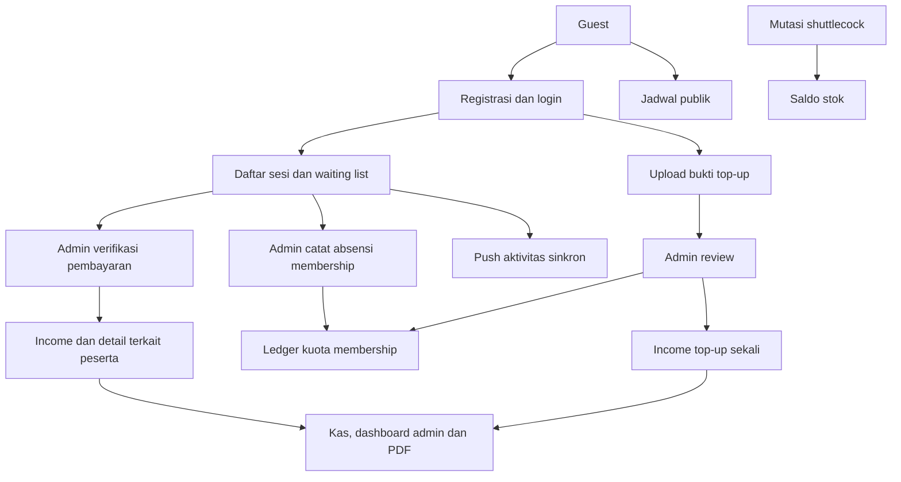

# Konteks final proyek NgeBadmintonYuk

Snapshot audit: **7 September 2026**. Dokumen ini adalah konteks serah-terima keadaan repository, bukan pernyataan bahwa semua backlog atau deployment selesai.

## Tahap terbaru: kas–kuota dan siklus peserta

Poin 1–2 telah diimplementasikan sesuai keputusan pengguna: persetujuan top-up mencatat pemasukan sekali; pemakaian kuota tidak membuat pemasukan baru; no-show tidak memotong kuota.

- Top-up approved secara atomik membuat linked income kategori Top Up Kuota dan +4 kredit. Nominal memakai snapshot pengajuan, tanggal kas memakai tanggal persetujuan. Income ini tidak dapat diedit/dihapus manual.
- Pilihan pembayaran sesi sekarang transfer, cash atau membership. Daftar/waiting belum memesan atau memotong kredit. Member perlu kuota aktif yang cocok saat absensi.
- Membership + present memakai satu kredit dan menandai pembayaran paid. Koreksi ke no_show mengembalikan kredit dan menjadi unpaid; koreksi ke listed juga menghapus absensi. Simpan status hadir berulang tidak memotong dua kali.
- Tunai/transfer tetap membuat linked income berdasarkan tanggal/harga sesi; hadir tidak memakai kuota. Sebelum beralih ke membership, admin membatalkan catatan pembayaran uang lama; setelah absensi diproses, koreksi ke listed dahulu sebelum mengganti metode/pemain.
- Endpoint absensi lama dan editor peserta memakai proses yang sama untuk peserta terdaftar. Jalur paket tanpa registrasi tetap kompatibel. Pilihan charged_absent dihapus untuk pencatatan baru; data historis tetap bisa ditampilkan.
- Waiting list tidak bisa diproses kehadirannya. Sesi berisi peserta/absensi tidak bisa dihapus. Pembatalan sesi ditolak selama ada pembayaran paid atau penggunaan kuota yang belum dikoreksi.
- Penghapusan member dengan top-up/absensi/pembayaran diproteksi. Update sesi mengecek ulang kapasitas serta perubahan jadwal/harga di dalam transaction dengan row lock.
- Batas tanggal laporan dibuat inklusif melalui whereDate agar pemasukan hari terakhir tidak terlewat, termasuk pada SQLite tes.

**Verifikasi terbaru:** seluruh 68 feature tests lulus (349 assertions), termasuk 15 tes baru dalam [CashQuotaLifecycleTest](../tests/Feature/CashQuotaLifecycleTest.php). Tes penyesuaian kuota lama diperbaiki agar mengurutkan transaksi dengan ID ketika timestamp sama. Pint lulus. Tes integritas docs/graph dijalankan lagi setelah regenerasi artefak.

**Penerapan belum selesai di database lokal:** MySQL 127.0.0.1:3306 menolak koneksi saat migrate:status. Migration [penautan income top-up](../database/migrations/2026_09_07_143625_add_income_id_to_top_up_requests_table.php) sudah teruji dalam SQLite in-memory tetapi belum diterapkan ke MySQL aplikasi. Setelah MySQL tersedia, jalankan `php artisan migrate --no-interaction` sebelum menggunakan perubahan ini.

Persetujuan top-up lama tidak di-backfill otomatis karena bisa sudah dicatat manual dalam kas. Registrasi/absensi dan potongan charged_absent historis juga tidak diubah massal. Refund uang nyata dilakukan admin di luar aplikasi; perubahan paid→unpaid mengoreksi catatan, bukan mentransfer uang. Pembatalan/refund top-up approved belum tersedia. Integrasi stok→expense tetap di luar tahap ini.

## Identitas dan scope

NgeBadmintonYuk adalah aplikasi operasional komunitas badminton dengan modul keuangan NgeKas. Akses utama: guest (jadwal publik, daftar/login), member (dashboard pribadi, daftar/batal main, kuota/top-up, notifikasi, papan skor), dan admin (keuangan, member/paket, sesi/peserta/pembayaran/absensi, stok, review top-up, broadcast).

Sumber kebenaran perilaku: kode route, Controller/Request/Action/Service, model dan migration, kemudian tes aktual. [Matriks fitur](10-current-features.md) menghubungkan fitur dengan implementasi dan kekurangan coverage. Ringkasan status di awal docs 00–09 mengoreksi rancangan lama yang tetap disimpan sebagai arsip.

## Stack yang diperiksa

Hasil `composer show --direct`: PHP CLI 8.5.1, Laravel 13.25.0, Livewire 4.4.0, Blaze 1.0.15, DomPDF wrapper 3.1.2, minishlink/web-push 11.0.0, google/auth 1.53.0, Pest 5.1.1, Pest Laravel 5.0.1, Pint 1.30.5. `package.json` meminta Tailwind 4, Vite 8 dan Firebase 12. Gunakan lockfile/dependency terpasang untuk versi tepat pada pekerjaan berikutnya.

Halaman domain saat ini berupa Controller + Blade dan JavaScript. Keberadaan paket Livewire tidak berarti perlu mengganti halaman menjadi komponen Livewire. Jangan membuat IncomeRepository, ExpenseRepository, CategoryRepository atau DashboardService hanya karena nama itu ada dalam arsip.

## Peta sumber

- [routes/web.php](../routes/web.php): seluruh endpoint aplikasi dan middleware akses.
- [app/Http/Controllers](../app/Http/Controllers) dan [Requests](../app/Http/Requests): alur halaman, validasi, otorisasi; keuangan awal masih memakai validasi inline.
- [app/Actions](../app/Actions): perubahan kuota, top-up, sesi, pembayaran, stok, penghapusan, push.
- [TransactionService](../app/Services/TransactionService.php): simpan/hapus transaksi manual; proteksi linked income peserta.
- [ReportService](../app/Services/ReportService.php) dan [ReportRepository](../app/Repositories/ReportRepository.php): agregasi periode/saldo dan data PDF/dashboard.
- [app/Models](../app/Models), [database/migrations](../database/migrations): relasi, ledger, unique key dan aturan penghapusan. Inventaris tabel ada di [database](02-database.md).
- [resources/views](../resources/views), [resources/js](../resources/js), [resources/css/app.css](../resources/css/app.css): halaman, PWA/push, papan skor dan tampilan.
- [config/community.php](../config/community.php): konfigurasi komunitas/rekening; [config/services.php](../config/services.php): konfigurasi push. Jangan menyalin kredensial ke docs/graph.
- [tests/Feature](../tests/Feature), [tests/JavaScript](../tests/JavaScript): bukti pengujian aplikasi. [phpunit.xml](../phpunit.xml) menggunakan SQLite in-memory untuk tes.
- [.ai/rules/index.md](../.ai/rules/index.md): baca aturan sesuai area sebelum mengubah kode. [AGENTS.md](../AGENTS.md): prosedur proyek.

## Alur dan batas integrasi



Top-up approved sekarang otomatis menuju Income; absensi peserta bermetode membership menuju ledger kuota tanpa income tambahan. Stok belum otomatis menuju Expense. Kas uang, kuota main, dan stok tetap tiga perhitungan terpisah. Aturan rinci dan seluruh fitur ada di [matriks](10-current-features.md).

## Status Graphify

Graph lama hanya mewakili fase keuangan awal. `graphify update .` mengekstrak kode terbaru secara lokal tanpa LLM/API. `graph.json`, manifest, metadata analisis dan report diperbarui setelah perubahan kas–kuota. Angka node/relasi terakhir ada di [GRAPH_REPORT.md](../graphify-out/GRAPH_REPORT.md); [graph.html](../graphify-out/graph.html) adalah navigasi visual hasil generator.

Graph kode adalah hasil ekstraksi statis, bukan bukti fitur telah lulus tes. Perintah update tidak melakukan ekstraksi semantik isi Markdown. Karena itu [matriks fitur](10-current-features.md) menjadi penghubung eksplisit dokumen–kode–tes; jangan menganggap semua isi docs sudah menjadi node semantik. Warning ekstraktor untuk boost.json dan pint.json tanpa node bukan modul aplikasi yang hilang.

Regenerasi setelah kode berubah:

```text
graphify update .
graphify cluster-only . --no-label
```

Setelah perubahan fitur, perbarui status modul, matriks, konteks ini, lalu jalankan validasi referensi dokumen dan integritas graph. Angka node/community dapat berubah karena tes atau dependency; gunakan report hasil regenerasi terakhir.

## Riwayat verifikasi audit awal, sebelum tahap kas–kuota

- Route aplikasi berhasil diinventarisasi dengan `php artisan route:list --except-vendor --json`.
- Tes baru [ProjectContextTest](../tests/Unit/ProjectContextTest.php) lulus melalui `php artisan test --compact tests/Unit/ProjectContextTest.php`: **2 tes, 5.116 assertions**. Memeriksa tautan dokumen lokal, cakupan class aplikasi dalam graph, keunikan node, endpoint relasi, dan kesesuaian komunitas pada metadata analisis. Ini tes integritas artefak, bukan coverage perilaku seluruh fitur.
- `vendor/bin/pint --dirty --format agent` lulus untuk perubahan PHP pada tes dokumentasi.
- `php artisan test --compact` terhalang driver SQLite yang tidak aktif di PHP CLI. Tidak ada perubahan database produksi atau php.ini sistem.
- Menjalankan Pest langsung dengan `php -d extension=pdo_sqlite -d extension=sqlite3 vendor/pestphp/pest/bin/pest --compact` menghasilkan **53 lulus, 1 gagal, 252 assertions** pada suite awal 54 tes. Opsi extension pada proses Artisan saja tidak diteruskan ke proses tes anak.
- Kegagalan awal: MembershipManagementTest, `administrator can reduce a member credit with an audited adjustment`, baris 74, ekspektasi type adjustment mendapat credit. Saldo tiga sudah lolos; kemungkinan pemilihan transaksi pada timestamp sama perlu diperiksa. Tidak ada perbaikan bisnis membership dalam audit docs ini.
- Tes JavaScript belum dapat dijalankan dengan Node bawaan v14.20.0 karena opsi `--test` tidak tersedia. Gunakan runtime Node yang mendukung test runner serta versi Vite terpasang, lalu jalankan `node --test tests/JavaScript/pwa-install.test.js tests/JavaScript/scoreboard.test.js`.
- Pemeriksaan visual browser, push nyata, PDF render, build frontend, dan deployment belum dilakukan. Keberadaan kode/tes tidak sama dengan validasi produksi.

## Konteks siap dipakai untuk pekerjaan berikutnya

> Kerjakan NgeBadmintonYuk sebagai aplikasi komunitas + keuangan. Baca tahap terbaru docs/11-final-context.md dan matriks docs/10-current-features.md. Ikuti AGENTS.md dan .ai/rules sesuai area. Pertahankan Controller + Blade, Actions domain, TransactionService serta ReportService/ReportRepository. Top-up approved membuat income sekali dan +4 kredit; pemakaian membership saat hadir tidak membuat income lagi. No-show tidak memotong kredit; koreksi hadir mengembalikannya. Cash/transfer tidak memakai kredit. Jangan mengedit linked income dari transaksi manual, melakukan backfill data historis tanpa rekonsiliasi, atau menganggap koreksi pembayaran mentransfer refund. Migration top-up belum diterapkan ke MySQL lokal yang tidak tersedia. Integrasi stok→expense belum ada. Verifikasi versi package/search-docs sebelum perubahan, lalu perbarui tes, docs dan Graphify.
