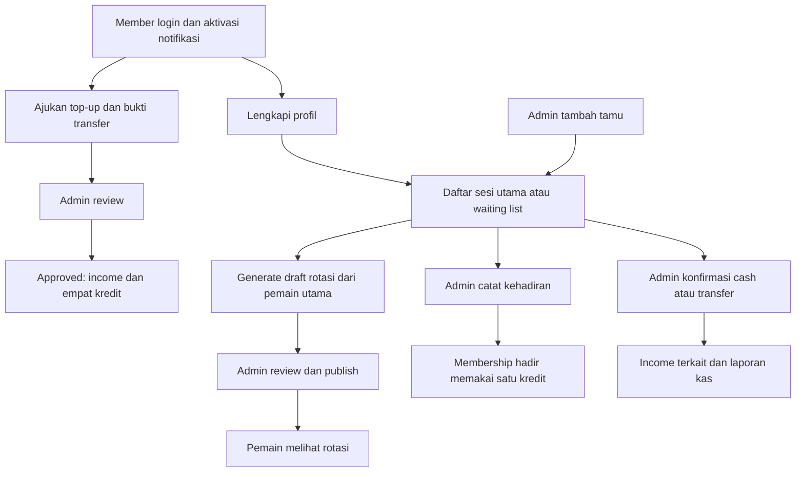

# PRD NgeBadmintonYuk — baseline 15 September 2026

Status dokumen: baseline implementasi dan usulan prioritas berikutnya. Persyaratan yang bertanda **tersedia** bersumber dari repository; usulan pengembangan belum menjadi komitmen bisnis. Dokumen ini menggantikan asumsi scope MVP pada dokumen lama untuk perencanaan produk, tanpa menghapus arsip.

## 1. Ringkasan produk dan posisi proyek

NgeBadmintonYuk adalah aplikasi operasional komunitas badminton dengan modul keuangan NgeKas. Pengelola mengatur pemain, tamu, jadwal, kapasitas, kehadiran, pembayaran, kuota, rotasi pertandingan, inventori, dan laporan. Member mendaftar sesi, mengajukan top-up, melihat informasi komunitas, dan menggunakan alat pendukung bermain.

Proyek sudah melewati MVP keuangan dan berada pada tahap **fitur operasional inti tersedia, menuju validasi rilis**. Ini penilaian berdasarkan kode dan tes lokal, bukan bukti deployment atau penerimaan pengguna. Persentase penyelesaian tidak diberikan karena target rilis dan cakupan penerimaan belum disepakati.

Perubahan besar dibanding rancangan awal: registrasi member, dashboard per peran, paket kuota, top-up manual, waiting list, pembayaran peserta yang terhubung kas, tamu tanpa akun melalui admin, profil komunitas, rotasi ganda dengan draft/publikasi, laporan member, PWA, papan skor, dan Story Studio.

## 2. Masalah dan tujuan

Masalah yang ditangani adalah pencatatan peserta dan pembayaran yang terpisah, sulitnya menelusuri kuota, risiko daftar melebihi kapasitas, pembagian giliran main yang manual, serta laporan kas dan kehadiran yang harus direkap ulang.

Tujuan rilis berikutnya:

- Memastikan satu alur sesi dari pendaftaran sampai absensi dan laporan dapat dipakai pengelola.
- Menjaga kas, kuota, dan stok konsisten saat ada koreksi atau pengiriman ulang tindakan.
- Memberi pemain informasi slot dan rotasi yang sesuai daftar terkini.
- Melindungi data pribadi dan bukti transfer dari akses pengguna lain.
- Membuktikan kesiapan perangkat dan operasional sebelum menyatakan aplikasi siap produksi.

## 3. Pengguna dan akses

| Pengguna | Kebutuhan dan akses |
| --- | --- |
| Pengunjung tanpa login | Melihat jadwal publik, login, dan membuat akun member. Tidak mendaftar sesi sendiri tanpa akun. |
| Member | Dashboard pribadi, profil, pendaftaran/pembatalan sesi yang memenuhi syarat, top-up, profil sesama pemain, rotasi terpublikasi, papan skor, Story Studio. |
| Admin | Keuangan, laporan, member/paket, tamu, sesi/absensi/pembayaran, review top-up, rotasi, inventori dan broadcast notifikasi. |
| Tamu pemain | Kontak Guest yang dibuat admin dan ditambahkan ke sesi; tidak memerlukan akun atau aktivasi push. Berbeda dari pengunjung website. |

Member wajib mengaktifkan Web Push pada browser/session saat ini sebelum memakai fitur member. Subscription pada perangkat lain tidak cukup. Setup, endpoint subscription dan logout tetap dapat diakses. Admin dan pengunjung tanpa login dikecualikan dari kewajiban notifikasi member. Nama dan tanggal lahir valid menjadi syarat profil lengkap sebelum pendaftaran sesi; foto, nickname, WhatsApp dan level bermain opsional.

## 4. Cakupan dan kriteria penerimaan

Semua modul berikut tersedia dalam kode. Kriteria penerimaan menjadi baseline yang perlu dipertahankan; tes otomatis bukan pengganti penerimaan operasional.

| ID | Modul | Kriteria penerimaan utama | Bukti tes |
| --- | --- | --- | --- |
| FR-01 | Akun dan akses | Login/logout dan registrasi tersedia; member tidak dapat menjalankan operasi admin; aktivasi notifikasi terikat perangkat/session. | [FinanceTest](../tests/Feature/FinanceTest.php), [MembershipRegistrationTest](../tests/Feature/MembershipRegistrationTest.php), [MemberNotificationRequirementTest](../tests/Feature/MemberNotificationRequirementTest.php) |
| FR-02 | Profil pemain | Member memperbarui nama/tanggal lahir dan atribut opsional; foto disimpan privat. Profil sesama pemain hanya menampilkan nama, nickname, level dan foto, tanpa email/telepon/tanggal lahir/kuota. | [MemberProfileTest](../tests/Feature/MemberProfileTest.php), [CommunityProfileTest](../tests/Feature/CommunityProfileTest.php) |
| FR-03 | Jadwal dan peserta | Katalog/detail sesi publik dan admin tersedia dengan filter bulan; daftar utama dan waiting list berbagi batas kapasitas; akun tidak terdaftar dua kali di sesi sama. | [PlaySessionRegistrationTest](../tests/Feature/PlaySessionRegistrationTest.php), [PlaySessionMonthFilterTest](../tests/Feature/PlaySessionMonthFilterTest.php) |
| FR-04 | Tamu | Admin membuat/mengubah kontak dan menambahkan tamu ke sesi; kapasitas dan sanksi berlaku; perubahan kontak tidak menulis ulang snapshot histori. Tamu tidak memakai membership. | [GuestManagementTest](../tests/Feature/GuestManagementTest.php) |
| FR-05 | Membership dan absensi | Saldo kuota berasal dari ledger; hadir bermetode membership memakai satu kredit yang memenuhi syarat; koreksi mengembalikan kredit; no-show tidak memakai kuota. | [MembershipManagementTest](../tests/Feature/MembershipManagementTest.php), [CashQuotaLifecycleTest](../tests/Feature/CashQuotaLifecycleTest.php) |
| FR-06 | Top-up | Bukti transfer privat dan harga paket tersimpan saat pengajuan; approval hanya sekali dan secara atomik membuat satu income serta +4 kredit. Penolakan tidak menambah kredit/kas. | [MembershipRegistrationTest](../tests/Feature/MembershipRegistrationTest.php), [CashQuotaLifecycleTest](../tests/Feature/CashQuotaLifecycleTest.php) |
| FR-07 | Pembayaran sesi | Cash/transfer pemain utama dapat dikonfirmasi dan membuat satu linked income; waiting list belum boleh dibayar; membership tidak membuat income baru. Income terkait terlindung dari perubahan manual. | [PlaySessionRegistrationTest](../tests/Feature/PlaySessionRegistrationTest.php), [CashQuotaLifecycleTest](../tests/Feature/CashQuotaLifecycleTest.php) |
| FR-08 | Kas dan laporan | Kategori dan transaksi detail tersedia; total dihitung dari detail; saldo dari pemasukan dikurangi pengeluaran; filter periode dan PDF menggunakan data laporan yang konsisten. | [FinanceTest](../tests/Feature/FinanceTest.php) |
| FR-09 | Laporan member/tamu | Admin memperoleh kehadiran, pembayaran, top-up dan kuota; summary seluruh hasil filter tidak terbatas halaman; PDF memakai filter yang sama; tamu dipisah. Preview ulang tahun hari ini sampai tujuh hari mendatang tidak mengirim otomatis. | [MemberReportTest](../tests/Feature/MemberReportTest.php) |
| FR-10 | Rotasi ganda | Admin memilih 1 atau 2 set × 21 poin untuk 1–2 lapangan; generate membuat draft; admin meninjau dan publish versi yang sama; daftar utama termasuk tamu, waiting list dikecualikan; roster/lapangan berubah membuat jadwal usang tersembunyi. | [SessionRotationTest](../tests/Feature/SessionRotationTest.php) |
| FR-11 | Inventori | Item dan pergerakan shuttlecock tersedia; saldo dihitung dari mutasi; mutasi tidak boleh membuat stok negatif. | [ShuttlecockInventoryTest](../tests/Feature/ShuttlecockInventoryTest.php) |
| FR-12 | Notifikasi dan PWA | Broadcast admin dan aktivitas registrasi memakai layanan push; izin hanya diminta setelah tindakan pengguna; kegagalan setup menyediakan retry; instalasi browser/iOS memiliki alur panduan. | [PushNotificationTest](../tests/Feature/PushNotificationTest.php), [tes JavaScript](../tests/JavaScript) |
| FR-13 | Papan skor | Aturan 21 poin, selisih dua, batas 30 dan best of three tersedia; state tersimpan lokal di perangkat. | [ScoreboardTest](../tests/Feature/ScoreboardTest.php), [scoreboard.test.js](../tests/JavaScript/scoreboard.test.js) |
| FR-14 | Story Studio dan pengalaman UI | Pengguna memilih tiga desain, mengambil/mengunggah foto, mengatur crop/zoom dan mengunduh PNG 1080×1920; share mengikuti dukungan perangkat. Loading dan banner versi aplikasi tersedia. | [StoryStudioTest](../tests/Unit/StoryStudioTest.php), [tes JavaScript](../tests/JavaScript) |

## 5. Aturan bisnis yang berlaku

- Urutan registrasi mengikuti ID. Penghapusan entri sebelumnya dapat menaikkan waiting list secara otomatis. Pendaftaran ditutup jika sesi bukan scheduled atau waktunya telah lewat.
- Member hanya membatalkan registrasi sendiri yang belum dibayar, masih listed, pada sesi mendatang berstatus scheduled. Penghapusan admin juga melindungi histori pembayaran/kehadiran.
- Tiga no-show memblokir pendaftaran baru berdasarkan user_id atau guest_id; koreksi absensi mengurangi hitungan dan dapat membuka blokir.
- Kuota dihitung dari membership_transactions. Kelayakan paket mengikuti status, masa berlaku dan kecocokan sesi; Paket Komunitas menjadi fallback sesuai implementasi.
- Harga top-up dapat diatur admin; default Rp110.000. Kredit setiap approval tetap empat. Persetujuan historis tidak di-backfill otomatis.
- Kas top-up dicatat saat persetujuan. Hadir menggunakan membership tidak mencatat kas lagi. Cash/transfer tidak mengurangi kuota.
- Perubahan paid menjadi unpaid adalah koreksi catatan. Komunitas tidak memiliki alur refund; koreksi bukan bukti uang dikembalikan.
- Rotasi adalah rencana giliran, bukan catatan hasil, absensi atau kas. Jumlah ronde = floor(durasi sesi / (jumlah set * menit per set)), maksimal 80. Default durasi 180 menit dan 15 menit per set, tanpa tambahan waktu pergantian. Dua lapangan diberi label A/B; algoritma memprioritaskan giliran yang merata, pemerataan penggunaan A/B, serta variasi pasangan dan lawan. Waktu selesai merupakan perkiraan dari waktu mulai ditambah durasi sesi. Durasi yang tidak cukup untuk satu ronde ditolak.
- Publikasi rotasi harus eksplisit; regenerasi menarik publikasi lama. Daftar rotasi pribadi difilter berdasarkan keikutsertaan, sedangkan endpoint detail saat ini dapat diakses pengguna terautentikasi dengan jadwal terpublikasi. Jangan menganggap ada pembatasan peserta atau waktu mulai pada endpoint detail tanpa mengubah implementasi dan tes.
- Stok belum terhubung otomatis ke expense. Kas uang, kuota main dan stok adalah tiga perhitungan berbeda.

## 6. Alur utama

## 7. Kebutuhan nonfungsional dan batas verifikasi

| Area | Baseline dan syarat rilis |
| --- | --- |
| Integritas | Mutasi kas/kuota yang terkait harus atomik dan tidak menggandakan efek. Kapasitas serta versi rotasi memiliki lock/check; uji concurrency pada database target masih perlu dilakukan. |
| Privasi | Bukti transfer dan avatar privat; pembatasan admin/member dan profil peer harus tetap lulus tes. |
| Perangkat | Validasi nyata pada Android Chrome dan iOS/Safari/PWA untuk login, push, upload, install, skor dan export story. Belum dibuktikan oleh audit ini. |
| Pelaporan | Rekonsiliasi angka kas, top-up, kehadiran dan ledger dengan contoh data operasional; periksa hasil PDF secara visual. |
| Operasional | Bukti migration pada database target, backup/restore, konfigurasi push/storage/HTTPS dan observasi kegagalan sebelum rilis. Audit ini tidak menjalankan migration produksi. |
| Performa | Belum ada hasil load test atau SLA. Tetapkan target waktu respons dan jumlah pengguna bersamaan sebelum pengujian beban. |

## 8. Kesenjangan dan prioritas berikutnya

Prioritas di bawah merupakan rekomendasi dari audit, bukan fitur yang sudah disetujui untuk dibuat.

| Prioritas | Pekerjaan | Kriteria selesai |
| --- | --- | --- |
| P0 | UAT satu siklus sesi lengkap | Admin/member/tamu menjalankan daftar, promosi waiting list, cash/transfer, top-up, hadir/no-show/koreksi dan laporan dengan hasil yang direkonsiliasi. |
| P0 | Validasi deployment dan integrasi nyata | Migration target tervalidasi, backup berhasil dipulihkan pada lingkungan uji, push masuk perangkat, berkas privat dapat diakses hanya pemilik/admin, PDF terbaca. |
| P0 | Putuskan akses rotasi | Pemilik produk memutuskan apakah detail rotasi untuk semua member atau hanya peserta, serta kapan dapat dilihat; aturan, route dan tes kemudian harus konsisten. |
| P1 | Uji concurrency database target | Pengajuan serentak tidak melampaui kapasitas; approval/payment tidak ganda; perubahan roster saat publish ditolak. SQLite unit/feature tidak membuktikan semua perilaku lock MySQL. |
| P1 | Konsolidasikan dokumentasi | PRD ini menjadi baseline scope; header dokumen lama diarahkan ke baseline terbaru setelah review agar aturan historis tidak dipakai sebagai kebutuhan aktif. |
| P1 | Evaluasi keandalan push sinkron | Ukur waktu dan kegagalan pengiriman; putuskan kebutuhan antrean/retry dari bukti, lalu jaga mutasi bisnis tetap konsisten. |
| P2 | Integrasi pembelian stok dan expense | Tentukan sumber pencatatan, koreksi dan pencegahan double count sebelum implementasi. Saat ini belum tersedia. |

Payment gateway, export Excel, pembukuan formal/multi-kas, audit log global, ranking/turnamen, aplikasi native dan sinkronisasi papan skor lintas perangkat belum ditemukan sebagai fitur aktif. Fitur-fitur tersebut tidak termasuk baseline rilis ini.

## 9. Ukuran keberhasilan yang diusulkan

Target berikut belum merupakan hasil pengukuran: nol selisih pada rekonsiliasi skenario UAT; nol akses privat yang lolos tanpa izin; nol efek ganda pada approval/payment ulang; seluruh skenario P0 diterima pengelola. Setelah pilot, ukur tingkat pendaftaran selesai, kegagalan top-up/push, waktu review top-up dan waktu admin menutup satu sesi. Instrumentasi produk dan baseline angka belum diverifikasi.

## 10. Sumber teknis dan hasil audit

Baseline diperiksa dari [route aplikasi](../routes/web.php), [Actions](../app/Actions), [Services](../app/Services), [models](../app/Models), [migration](../database/migrations), [views](../resources/views), [JavaScript](../resources/js) dan [tests](../tests). Dokumentasi historis: [matriks fitur](10-current-features.md) dan [konteks sebelumnya](11-final-context.md).

Versi direct dependency terpasang hasil composer show --direct: PHP CLI 8.5.9, Laravel 13.25.0, Livewire 4.4.0, Blaze 1.0.15, DomPDF 3.1.2, Web Push 11.0.0, Pest 5.1.1. Node yang digunakan 24.20.0. package.json mendeklarasikan Tailwind 4, Vite 8 dan Firebase 12; deklarasi rentang tidak menyatakan versi terpasang tepat.

Arsitektur aktif adalah Controller → Blade/JavaScript, Actions domain, TransactionService, dan ReportService → ReportRepository. Tidak ditemukan directive wire: atau penggunaan komponen Livewire pada pencarian app/resources/views/routes; keberadaan dependency Livewire tidak berarti UI telah memakai arsitektur komponen.

Hasil pemeriksaan lokal 15 September 2026:

- Inventaris route berhasil melalui php artisan route:list --except-vendor --json.
- node --test tests/JavaScript/*.test.js: **34 tes lulus, nol gagal**.
- Validasi tautan seluruh dokumen melalui ProjectContextTest dengan filter current documentation links resolve: **1 tes lulus, 155 assertions**, termasuk PRD ini.
- Run awal php artisan test --compact: 168 tes, 3 lulus, 1 gagal dan 164 error. Error berasal dari APP_KEY tidak tersedia dan driver SQLite CLI tidak aktif. Kegagalan integritas Graphify: app/Models/Guest.php belum tercakup dalam graph; graph perlu diregenerasi sebelum dianggap mencerminkan kode terbaru.
- Run ulang Pest langsung memakai APP_KEY dummy khusus proses dan extension SQLite khusus proses selesai: **161 dari 168 tes lulus, 7 gagal, 2.886 assertions**. Tidak ada perubahan .env/php.ini. Kegagalan yang terlihat mencakup integritas Graphify dan assertion teks halaman setup notifikasi; tujuh kegagalan perlu ditelusuri sebelum menyatakan suite backend bersih. Audit ini tidak memperbaiki kode aplikasi.

Batas audit: tidak memeriksa database/data produksi, melakukan deployment, mengirim push nyata, atau melakukan UAT visual perangkat. Riwayat hasil tes pada dokumen lama tidak dipakai sebagai hasil run terbaru.
